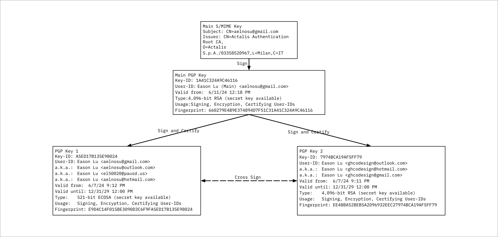

# CredentialStore: Public Key and Certificate Repository

## [How to Use the Repository](#how-to-use-the-repository-1)

## Overview

Welcome to the Public Key and Certificate Repository. This repository contains openPGP and S/MIME public key files, signatures, and certificates managed and maintained by the Repository Owner. These files serve multiple crucial functions, including the verification of identities, encryption of communications, and the establishment of a PGP Web of Trust (WOT).

The trust chain of the repository is as follows:


## Repository Functions

### 1. Identity Verification

The public keys and certificates available in this repository can be used to verify the identity of individuals and entities. By certifying a public key using your own PGP key and sending the certification back to the Repository Owner, you contribute to the trustworthiness and authenticity of these keys.

### 2. Encryption

Public keys in this repository can be used to encrypt messages and files, ensuring that only the intended recipient can decrypt and read the contents. This enhances the security and privacy of your communications.

### 3. Establishing a PGP Web of Trust (WOT)

The repository plays a pivotal role in establishing a PGP Web of Trust. By certifying keys and building a network of trusted entities, users can strengthen the overall security and reliability of their cryptographic communications.

## License Agreement

By using the files in this repository, you agree to the terms and conditions outlined in the [Public Key and Certificate License Agreement](LICENSE).

### Licenseing TL;DR

- You may not rely on the files unless you have certified them using your own PGP key and sent the certification back to the Repository Owner by using encrypted email to aelnosu@gmail.com
- The files are provided "as is" without any warranty.
- Your usage of these files indicates your acceptance of the license terms.

## How to Use the Repository

### Repository Structure

There are 8 important files in this repository:
.
├── Certification.txt (The main PGP key certification file)
├── Certification.txt.asc (The main PGP key certification file signature, signed by the PGP key)
├── Certification.txt.asc.p7s (The main PGP key certification file signature's signature, signed by the S/MIME key)
├── Certification.txt.asc.pkcs7 (The .p7s file converted to PKCS#7 format)
├── Certification.txt.asc.pkcs7.cert (The S/MIME key certificate)
├── Eason Lu_(Main)_0xA9C46116_public.asc (The main PGP key)
├── Key_1_0x35E98024_public.asc (The first key)
└── Key_2_0x9AF5FF79_public.asc (The second key)


### Verification of Main PGP Key

To verify the validity of the main PGP key, the file name is: `Eason Lu (Main)_0xA9C46116_public.asc`
Run the following command in your terminal:

```bash
openssl smime -verify -binary -inform PEM -in Certification.txt.asc.pkcs7 -content Certification.txt.asc -certfile Certification.txt.asc.pkcs7.cert
```

If the output is `Verification successful`, the main PGP key is valid and can be used to verify other keys in the repository.

### Importing Public Keys

To import a public key into your keyring, use the following command:

```bash
chmod +x import.sh
./import.sh
```
or 

```bash
gpg --keyserver keys.openpgp.org --recv-keys 1A41C324A9C46116 A5ED17B135E98024 7974BCA19AF5FF79
```

### Building a Web of Trust
If you want to help me build a Web of Trust, please certify the main PGP key and send the certification back to me by using encrypted email to aelnosu@gmail.com. The certification process is crucial for establishing trust and authenticity in the PGP Web of Trust.

 Certify the main PGP key by running the following command:

```bash
gpg --sign-key 660279E4B9E374894D7F51C31A41C324A9C46116
```

Then follow the instructions to complete the certification process. Please mark the key as trust fully as that allow you to verify the other keys in the repository.

After you are done, export the certification and send it back to me by using encrypted email to aelnosu@gmail.com.
This procress can be easily done by using thunderbird, or by using the following command:

```bash
gpg --armor --export 660279E4B9E374894D7F51C31A41C324A9C46116 > Signed_Main.asc
gpg --output Signed_Main.asc.pgp --encrypt --recipient 660279E4B9E374894D7F51C31A41C324A9C46116 Signed_Main.asc
```

Then attach the `Signed_Main.asc.pgp` file to an email and send it to aelnosu@gmail.com

Thank you.

### Verification of Other Keys
After you have marked the Main key to trust fully, the other keys will be also marked as valid.